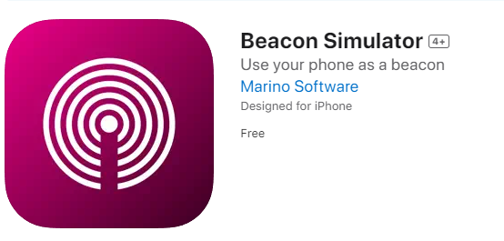
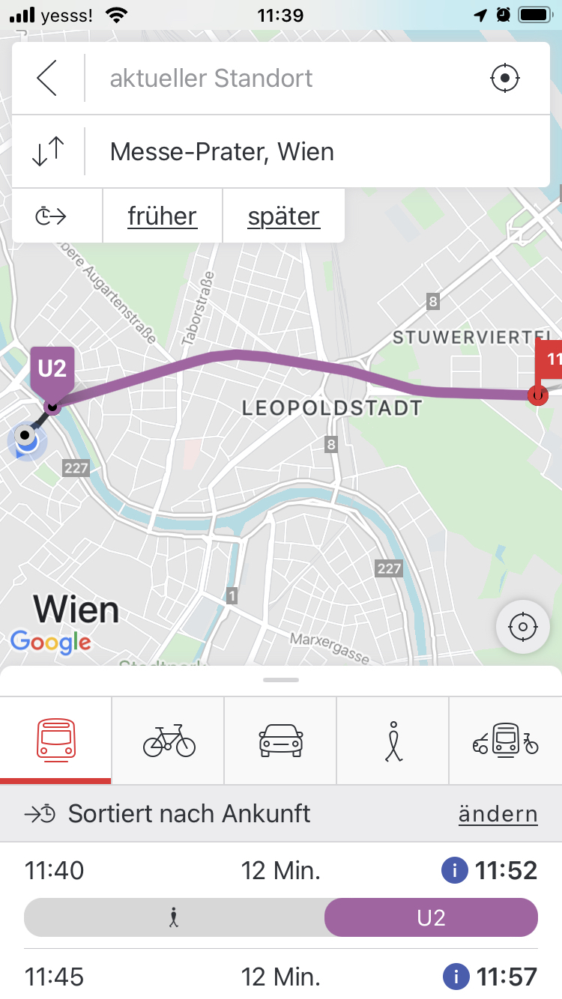
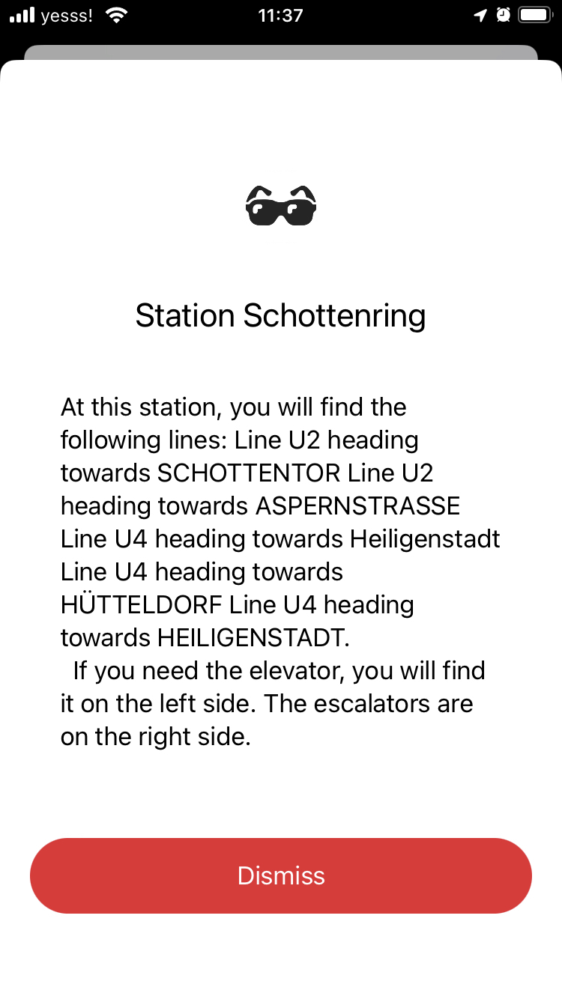

# Der Wegfinder

### Beschreibung

In diesem Projekt wird ein Feature für WienMobile App entwickelt, welches es ermöglicht, dass sich Sehbehinderte in der Stadt Wien besser zurechtfinden können.
Überrall in den wichtigen Positionen der Ubahn Stationen werden Beacons platziert, welche die Position des Benutzers an die App senden. Die App kann dann die Position des Benutzers mit Hilfe der Beacons bestimmen und dem Benutzer die Richtung zu seinem Ziel anzeigen.

### Technologien

Für dieses Projekt werden folgende Technologien verwendet:

- Express JS
- SQLite
- Javascript
- Swift
- Wiener Linien API

### Installation

1. Repository klonen
2. navigieren Sie in den Ordner `server` und führen Sie `npm install` aus um die benötigten Pakete zu installieren.
3. Um den Server zu starten führen Sie `npm start` aus.
4. Navigieren Sie in `ios app` Ordner und öffnen Sie die Datei `UbahnStationWegbeschreibung.xcodeproj` mit Xcode.
5. Um das ganze zu Simulieren, müssen Sie auf einem **anderen IOS Gerät** die App `Beacon Simulator` installieren und ein von diese 3 Beacons auswählen:



```
F9DF84FC-1145-4D0B-9AC7-F2FAD5EFF690
4750BAAB-FAAC-4ADF-9FE4-85652FA6C580
EA33B1EC-4A91-4577-9983-0978DDD237BA
```

6. Öffnen Sie unsere Demo App auf dem IOS Gerät und klicken Sie auf die Karte um den scan zu starten.

<div>
   
   
<div>
